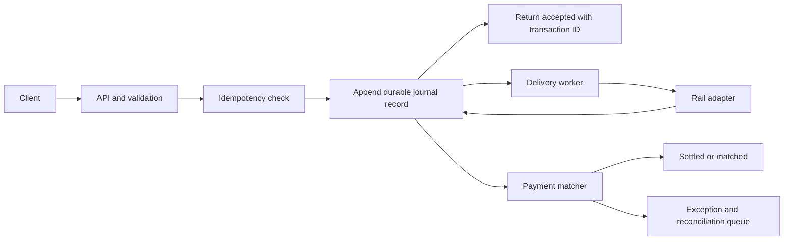

# Plan: Rust payment-rail backend

I’m assuming you meant **low P99 latency**—lower tail latency is better—and that “complete within milliseconds” means the API can confirm *durable acceptance* quickly. Final settlement depends on the external rail, so it can’t be guaranteed within a few milliseconds by this service alone.

## 1. Set the transaction rules first

Decide what each status means and when the service may return success:

`RECEIVED → VALIDATED → ACCEPTED_DURABLE → SUBMITTED → ACKNOWLEDGED → SETTLED`

Also define `REJECTED`, `UNKNOWN`, and `RECONCILIATION_REQUIRED`. A timeout after submission is `UNKNOWN` until checked; blindly resending could charge or pay twice.

Set separate latency goals for API acceptance, rail response, and settlement. Choose P99 targets after measuring the actual rail, storage, replication, and deployment environment.

## 2. Build the core processing path

Start with a Rust service using Tokio for async networking and I/O. Keep CPU-heavy matching and risk checks bounded so they don’t block async runtime workers; Tokio’s scheduling fairness depends on tasks yielding rather than blocking workers. [Tokio runtime documentation](https://docs.rs/tokio/latest/tokio/runtime/) describes its I/O driver and scheduler, and [Rust’s async guide](https://doc.rust-lang.org/book/ch17-00-async-await.html) explains how async work yields while waiting.

Use bounded queues and backpressure. Begin with a single durable writer per partition; add partitions when benchmarks show the journal or index is the bottleneck. Avoid letting arbitrary request concurrency mutate ledger state directly.

## 3. Use a journal as the source of truth

Since you don’t want a database, use append-only journal segment files. Each committed record should include a log sequence, transaction ID, idempotency scope and key, request hash, amount and currency, ledger entries, state change, timestamp, and checksum.

Add an ID index as a B+ tree mapping transaction IDs to journal offsets, plus an idempotency-key index mapping repeated client requests to the original result. Treat both indexes as rebuildable: after a crash, replay the journal and reconstruct them. That way, the index isn’t a second source of truth.

A B+ tree stored on disk is still database-like storage engineering. You’ll own atomic updates, corruption detection, recovery, backups, format upgrades, and repair. Keep that scope explicit.

For acknowledgements, define the durability boundary: for example, return “accepted” only after the journal is synced and—if the service must survive a machine or zone loss—replicated to the required number of peers. Group commit can reduce sync overhead, but its latency cost must be measured.

## 4. Make retries safe

Use a stable client idempotency key and a server transaction ID. Repeated requests with the same key should return the original transaction and result; RFC 9110 explains why retrying non-idempotent operations without a way to ensure idempotent effects is unsafe. [RFC 9110 §9.2.2](https://www.rfc-editor.org/rfc/rfc9110.html#section-9.2.2)

Retry only transient failures, with capped exponential backoff and jitter. Record each attempt as a new event linked to the same transaction; never create a fresh payment for a retry. For uncertain outcomes, query the rail or reconcile before resubmitting. If the rail lacks idempotency or status lookup, duplicate prevention cannot be guaranteed across a lost response.

## 5. Add the ledger and matching engine

Use immutable, double-entry ledger postings, integer minor-unit amounts, and explicit currency handling—never floating-point amounts. Enforce balanced postings and transaction-state rules before committing them to the journal.

Match rail confirmations and settlement records using defined fields such as rail reference, amount, currency, counterparty, and value date. Automatically settle only confident matches; route ambiguous or unmatched records to an exception queue with an audit trail.

## 6. Add operational and security controls

Track P50/P95/P99 latency separately for validation, journal sync, replication, rail round trip, and matching. Also track queue depth, retry age, duplicate requests, unknown outcomes, unmatched payments, and recovery time. Set alerts and procedures for reconciliation and manual exceptions.

Use transport encryption, strict authentication and authorization, key management, access auditing, and data minimization. If cardholder data is in scope, assess the applicable controls against the PCI SSC’s published [PCI DSS v4.0.1 materials](https://www.pcisecuritystandards.org/document_library/).

## 7. Roll out in stages

1. Build the domain model, journal format, ID index, and simulated rail adapter.
2. Run a sandbox pilot with bounded traffic, restart recovery, and duplicate-request scenarios.
3. Add replicated durability, monitoring, reconciliation, and operational runbooks.
4. Benchmark realistic concurrent loads, tune group commit and partitioning, then repeat measurements.
5. Use a restricted live pilot only after rail certification, recovery procedures, and jurisdiction-specific requirements are addressed.

This can become a **production-shaped pilot**, but “no failures” isn’t an achievable guarantee. A safer goal is no silent loss or duplicate posting, with failures detected, recoverable, and visible to operators.